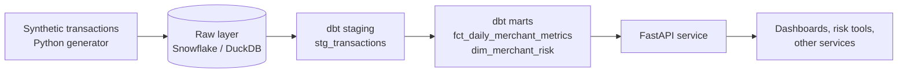

# Payments Risk API


A small, production-style data product: payment transactions land in **Snowflake**, **dbt** turns
them into tested merchant risk metrics, and a **FastAPI** service exposes those metrics to other
applications. Everything also runs locally on DuckDB, so CI needs no cloud account.

## Architecture



## What it shows

- **Data modeling in dbt** with staging and mart layers, schema tests, and a custom data test.
- **Correct metric design**: the daily fact table stores counts next to rates, so rates are
  re-aggregated from counts instead of averaged (averaging rates skews results toward low-volume days).
- **One API, two warehouses**: a small `Database` interface lets the same endpoints run on Snowflake
  in production and DuckDB in development and CI.
- **Safe SQL**: all user input is passed as bound parameters.
- **Engineering hygiene**: typed settings, Pydantic response models, pytest suite that builds a real
  warehouse per run, ruff linting, GitHub Actions CI, and a Dockerfile.

## Quick start (local, no Snowflake needed)

```bash
python -m venv .venv && source .venv/bin/activate
make install      # install dependencies
make data         # generate 50k transactions and load them into DuckDB
make dbt          # build and test the dbt models
make run          # start the API at http://localhost:8000/docs
make test         # run the test suite
```

## API

| Method | Path | Description |
| --- | --- | --- |
| GET | `/health` | Service status and active backend |
| GET | `/merchants/high-risk?limit=20` | Flagged merchants, highest dispute rate first |
| GET | `/merchants/{merchant_id}` | Risk profile for one merchant |
| GET | `/metrics/daily?start=&end=&merchant_id=` | Daily volume, decline and dispute rates |

Interactive docs are at `/docs` once the server is running.

## Running on Snowflake

1. Run `snowflake/setup.sql` to create the warehouse, database, stage and raw table.
2. Upload the CSV: `put file://data/transactions.csv @payments_risk.raw.transactions_stage;`
   then run the `copy into` statement.
3. Copy `.env.example` to `.env` and fill in your Snowflake credentials.
4. Build models: `cd dbt && DBT_TARGET=snowflake dbt build --profiles-dir .`
5. Start the API with `DB_BACKEND=snowflake make run`.

## Risk logic

A merchant is flagged when its dispute rate reaches `high_risk_dispute_rate` (default 1%) with at
least `min_transactions_for_flag` (default 50) transactions. Both are dbt variables in
`dbt/dbt_project.yml`. The thresholds are illustrative, not an industry rule.

## Roadmap

- [ ] Incremental loading with Snowflake Streams and Tasks
- [ ] Airflow or Dagster orchestration
- [ ] Natural-language questions endpoint using Snowflake Cortex
- [ ] Deploy the container to AWS App Runner or Cloud Run

## Project layout

```
app/          FastAPI service (config, db layer, schemas, routes)
dbt/          dbt project (staging, marts, tests, profiles for DuckDB and Snowflake)
scripts/      data generator and local loader
snowflake/    one-time Snowflake setup SQL
tests/        pytest suite (builds a real warehouse per run)
```
